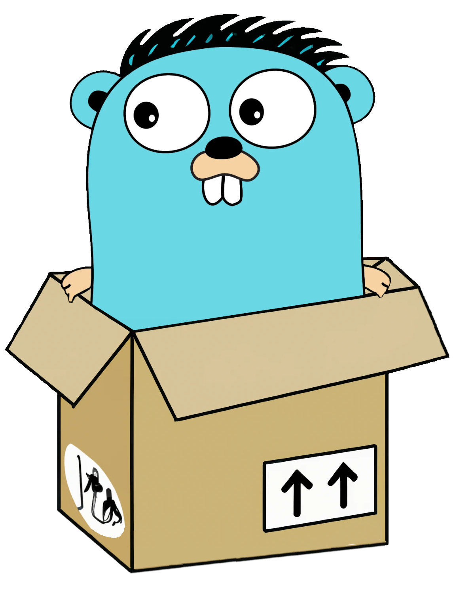

# GoBros Container


A flexible Inversion of Control container for GoLang that uses lazy loading
and generics to make it as easy to use as possible.

## Key Features:
* Lazy loading (bound concretes aren't resolved until requested)
* Multiple interfaces to one resolver. This allows a container that satisfies 
  multiple interfaces to be bound to the container and resolved by any of it's
  bound interfaces.
* Multiple resolvers to one interface. Allows a slice of concretes to be resolved
  for a given interface.
* Runtime checks when binding to help ensure the container is used correctly.

<br>

# Why Use Inversion of Control?
With Inversion of Control, dependencies can be satisfied automatically and
provided to a constructor function only when they're needed. Without it, most
systems end up with a complex tree of dependencies that must be passed from
parent to child.

# Installing
Run the following command in your project directory to install.

`go get github.com/gobros/container@latest`

# Terminology
* Concrete - A pointer to a struct that either fulfills an Interface or is
  assignable to a Pointer.
* Resolver - A function that returns a concrete.
* Bound Type - The Interface or Pointer to which a resolver is bound.

# Binding & Resolving Overview
The primary operations this container performs are binding and resolving. Below
is a short example of it in action.

```golang
// Bind our resolver that returns a concrete implementation of the interface RandomIntGenerator
container.MustBind[RandomIntGenerator](NewFairRandomIntGenerator)

// Resolve the bound concrete implementation of RandomIntGenerator
generator := container.MustResolve[RandomIntGenerator]()

// Use the generator
fmt.Printf("Random Number: %v\n", generator.Generate())
```

## Requirements To Bind
* Must bind against an Interface or Pointer type
* Resolvers must be a function
* Resolver must return a type that either implements or is assignable to the
  bound type as the first return parameter
* Resolver may have arguments, but they must be of type Interface, Pointer, or
  Slice so the container can attemp to resolve them
* If a Resolver returns an error, it must be the second return parameter
* If a resolver has any argument of type slice, it will receive an empty slice
  if nothing is currently bound. The resolver is expected to handle empty slices.

## Requirements To Resolve
* Provide an Interface or Pointer bound type to resolve

# Global Container Functions
These act upon the global container created by this module.

## Bind
Binds a resolver to a bound type. Can later be resolved for use.

### Definition
`Bind[T any](resolver any) error`

### Example
```golang
// Bind our resolver that returns a concrete implementation of the interface RandomIntGenerator
err := container.Bind[RandomIntGenerator](NewFairRandomIntGenerator)
if err != nil {
    return fmt.Errorf("failed to bind: %w", err)
}
```

---
## ResolveAll
Attempts to resolve and return all concretes bound to the provided type as a slice.

### Definition
`ResolveAll[T any]() ([]T, error)`

### Example
```golang
// Resolve all bound implementations of ShutdownCleanupRequired
cleaners, err := container.ResolveAll[ShutdownCleanupRequired]()
if err != nil {
    return fmt.Errorf("failed to get all ShutdownCleanupRequired: %w", err)
}

// Loop over slice and perform operations
for _, clean := range cleaners {
    clean.Cleanup()
}
```

---
## Resolve
Resolves a single concrete bound to the provided type. If multiple resolvers
were bound, the concrete from the most recent one is returned.

### Definition
`Resolve[T any]() (T, error)`

### Example
```golang
// Resolve the bound implementation of RandomIntGenerator
generator, err := container.Resolve[RandomIntGenerator]()
if err != nil {
    return fmt.Errorf("failed to get a RandomIntGenerator: %w", err)
}

// Use the generator
fmt.Printf("Random Number: %v\n", generator.Generate())
```

# Instance Container Functions
These act upon provided container argument. Can be used if you need multiple
containers don't want to use the global container provided.

```golang
func BindInstance[T any](container *Container, resolver any) error
func ResolveAllInstance[T any](container *Container) ([]T, error)
func ResolveInstance[T any](container *Container) (T, error)
```


# Must Container Functions
For convenience, there are helper functions that wrap all Global and Instance
Container Functions and panic if an error is encountered.

```golang
func MustBind[T any](resolver any)
func MustResolveAll[T any]() []T
func MustResolve[T any]() T
func MustBindInstance[T any](container *Container, resolver any)
func MustResolveAllInstance[T any](container *Container) []T
func MustResolveInstance[T any](container *Container) T
```

# Mascot Image
The GoBros/container gopher was based off original designs by
Renee French. (http://reneefrench.blogspot.com/)
